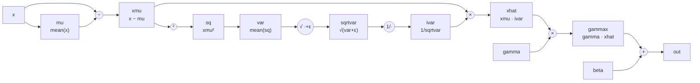

# BatchNorm2D

## The idea

As a network trains, the distribution of activations flowing into each
layer keeps shifting (its inputs change every time the layers before it
update). Batch normalization re-centers and re-scales each channel's
activations to zero mean and unit variance *within the current batch*, then
lets the network learn its own preferred scale and shift back (`gamma`,
`beta`) on top of that. In practice this stabilizes and speeds up training
considerably.

nabla splits this into two layers, deliberately:

- **`ops/batchnorm.py`** ([`BatchNorm2D`](../src/nabla/ops/batchnorm.py)) is
  the differentiable normalization *using the current batch's statistics*
  (training mode) — this doc covers that.
- **`nn/batchnorm.py`**
  ([`BatchNorm2D`](../src/nabla/nn/batchnorm.py)) is the `Module` wrapper:
  it holds `gamma`/`beta` as trainable parameters, calls the op above in
  training mode, tracks a running average of the batch statistics
  (`running_mean`, `running_var`), and switches to normalizing with *those*
  running statistics in eval mode — via ordinary `Tensor` arithmetic, not a
  second `Function` (see the note at the end).

## The math

For input $x$ of shape `(batch, C, H, W)`, mean and variance are computed
**per channel**, over every other axis (`batch`, `H`, `W`) — so each of the
$C$ channels gets normalized independently, using $N = \text{batch} \cdot H
\cdot W$ values:

$$
\mu_c = \frac{1}{N}\sum x_c \qquad \sigma^2_c = \frac{1}{N}\sum (x_c - \mu_c)^2
$$

$$
\hat{x} = \frac{x - \mu}{\sqrt{\sigma^2 + \varepsilon}} \qquad \text{out} = \gamma \cdot \hat{x} + \beta
$$

($\varepsilon$ is a small constant purely to avoid dividing by zero.) Note
this uses the **biased** variance (divide by $N$, not $N{-}1$) — the same
convention PyTorch and every other framework uses for the normalization
itself.

## Backward, derived from the computational graph

This is the one op in nabla where the backward pass genuinely needs the
full chain rule, because $\mu$ and $\sigma^2$ are each themselves functions
of *every* element of $x$ — so $\partial L/\partial x$ has to account for
$x$'s effect on the output both directly (through $\hat x$) and indirectly
(through $\mu$ and $\sigma^2$). The cleanest way to see *why* that's true —
and to derive the gradient without having to trust a closed-form formula on
faith — is to stop treating `out = gamma * x_hat + beta` as one big
expression and instead break it into the atomic operations that actually
produce it, one node per operation:



Every arrow is one local, easy-to-differentiate operation (`−`, `²`, a
mean, `√`, `1/·`, `×`, `+`). `backward()` just walks this graph
right-to-left: at each node, multiply the gradient flowing in from the
right by that node's *local* derivative, and where an arrow forked into two
uses on the way forward (every value that feeds more than one downstream
node), the gradients flowing back **add up** at that fork. `x` is exactly
such a fork — it feeds `mu` *and* the subtraction directly — which is the
graph's way of showing the "direct vs. indirect path" mentioned above
before you even write a formula.

Walking backward from `out` (this is exactly [Kratzert's derivation for
batchnorm](https://kratzert.github.io/2016/02/12/understanding-the-gradient-flow-through-the-batch-normalization-layer.html),
adapted to nabla's per-channel axes):

| node | local derivative | gradient produced |
| --- | --- | --- |
| `addNode` (`out = gammax + beta`) | $\partial\text{out}/\partial\text{gammax}=1$, $\partial\text{out}/\partial\beta=1$ | `grad_gammax = grad_out`; `grad_beta = sum(grad_out)` over every axis except channels |
| `mulNode2` (`gammax = gamma · xhat`) | $\partial\text{gammax}/\partial\hat x=\gamma$, $\partial\text{gammax}/\partial\gamma=\hat x$ | `grad_xhat = grad_gammax * gamma`; `grad_gamma = sum(grad_gammax * xhat)` |
| `mulNode1` (`xhat = xmu · ivar`) | $\partial\hat x/\partial x_\mu=\text{ivar}$, $\partial\hat x/\partial\text{ivar}=x_\mu$ | `grad_xmu_1 = grad_xhat * ivar` (first contribution to `xmu`); `grad_ivar = sum(grad_xhat * xmu)` (`ivar` is one shared scalar per channel, so its uses across every element of the channel all add up here) |
| `invNode` (`ivar = 1/sqrtvar`) | $\partial\,\text{ivar}/\partial\,\text{sqrtvar}=-1/\text{sqrtvar}^2$ | `grad_sqrtvar = grad_ivar * -1/sqrtvar**2` |
| `sqrtNode` (`sqrtvar = sqrt(var+eps)`) | $\partial\,\text{sqrtvar}/\partial\,\text{var}=\tfrac12(\text{var}+\varepsilon)^{-1/2}$ | `grad_var = grad_sqrtvar * 0.5 * (var+eps)**-0.5` |
| `varNode` (`var = mean(sq)`) | each of the $N$ elements of `sq` contributes $1/N$ | `grad_sq = grad_var / N`, broadcast back over every element |
| `sqNode` (`sq = xmu**2`) | $\partial\,\text{sq}/\partial x_\mu = 2 x_\mu$ | `grad_xmu_2 = grad_sq * 2 * xmu` (second contribution to `xmu`) |
| **fork: `xmu`** | `xmu` fed both `sqNode` and `mulNode1` on the way forward | `grad_xmu = grad_xmu_1 + grad_xmu_2` |
| `subNode` (`xmu = x - mu`) | $\partial x_\mu/\partial x=1$, $\partial x_\mu/\partial\mu=-1$ | `grad_x_1 = grad_xmu` (first contribution to `x`); `grad_mu = -sum(grad_xmu)` |
| `muNode` (`mu = mean(x)`) | each of the $N$ elements of `x` contributes $1/N$ | `grad_x_2 = grad_mu / N`, broadcast back over every element |
| **fork: `x`** | `x` fed both `muNode` and `subNode` on the way forward | `grad_x = grad_x_1 + grad_x_2` |

That's it — no step required more calculus than "derivative of $x^2$" or
"derivative of $1/x$". The closed-form formulas from the section above are
just this same table with the intermediate `sqrtvar`/`ivar`/`sq` nodes
algebraically substituted away, which is also exactly what the code below
does: it never materializes `sq`, `sqrtvar` or `ivar` as separate arrays,
it folds their local derivatives directly into `grad_var` and `grad_mean`.

**Recap in closed form**, for reference against the code:

$$
\frac{\partial L}{\partial \beta} = \sum \frac{\partial L}{\partial \text{out}} \qquad
\frac{\partial L}{\partial \gamma} = \sum \frac{\partial L}{\partial \text{out}} \cdot \hat{x}
$$

$$
\frac{\partial L}{\partial \hat{x}} = \frac{\partial L}{\partial \text{out}} \cdot \gamma
$$

$$
\frac{\partial L}{\partial \sigma^2} = \sum \frac{\partial L}{\partial \hat{x}} \cdot (x - \mu) \cdot \left(-\tfrac{1}{2}\right)(\sigma^2 + \varepsilon)^{-3/2}
$$

$$
\frac{\partial L}{\partial \mu} =
\underbrace{\sum \frac{\partial L}{\partial \hat{x}} \cdot \frac{-1}{\sqrt{\sigma^2+\varepsilon}}}_{\text{direct path, through } \hat x}
\;+\;
\underbrace{\frac{\partial L}{\partial \sigma^2} \cdot \frac{1}{N}\sum -2(x-\mu)}_{\text{indirect path, through } \sigma^2}
$$

$$
\frac{\partial L}{\partial x} =
\underbrace{\frac{\partial L}{\partial \hat{x}} \cdot \frac{1}{\sqrt{\sigma^2+\varepsilon}}}_{\text{direct}}
\;+\;
\underbrace{\frac{\partial L}{\partial \sigma^2} \cdot \frac{2(x-\mu)}{N}}_{\text{through } \sigma^2}
\;+\;
\underbrace{\frac{\partial L}{\partial \mu} \cdot \frac{1}{N}}_{\text{through } \mu}
$$

## Implementation

Each of those five steps is one block in
[`ops/batchnorm.py`](../src/nabla/ops/batchnorm.py):

```python
grad_beta  = np.sum(grad_output, axis=(0, 2, 3))
grad_gamma = np.sum(grad_output * self.x_hat, axis=(0, 2, 3))

grad_x_hat = grad_output * gamma_reshaped

grad_var = np.sum(grad_x_hat * self.x_centered * -0.5 * (self.batch_var + self.eps) ** -1.5,
                   axis=(0, 2, 3), keepdims=True)

grad_mean  = np.sum(grad_x_hat * -1 / np.sqrt(self.batch_var + self.eps), axis=(0, 2, 3), keepdims=True)
grad_mean += grad_var * np.mean(-2 * self.x_centered, axis=(0, 2, 3), keepdims=True)

grad_x  = grad_x_hat / np.sqrt(self.batch_var + self.eps)
grad_x += grad_var * 2 * self.x_centered / self.N
grad_x += grad_mean / self.N
```

`self.x_centered` (i.e. $x - \mu$) and `self.batch_var` are cached in
`forward` specifically because `backward` needs them again here — that's
the general pattern every `Function` in nabla follows (see
[Autodiff basics](01-autodiff.md)).

> **Bug we hit:** `forward` originally never set `self.N`
> (`batch * H * W`, the count backward divides by in steps 4 and 5 above) —
> an easy thing to forget since it's not needed anywhere in forward itself,
> only in backward. First call to `backward()` raised
> `AttributeError: 'BatchNorm2D' object has no attribute 'N'`. A reminder
> that "what does forward need to *cache* for backward" is a separate
> question from "what does forward need to *compute* its own output".

## Eval mode reuses ordinary ops, not a second Function

`nn/batchnorm.py`'s eval-mode path normalizes with the running statistics
using plain `Tensor` arithmetic instead of calling into the `Function`
above:

```python
mean = Tensor(self.running_mean.reshape(1, -1, 1, 1))
std  = Tensor(np.sqrt(self.running_var + self.eps).reshape(1, -1, 1, 1))
gamma = self.gamma.reshape((1, self.num_features, 1, 1))
beta  = self.beta.reshape((1, self.num_features, 1, 1))
return (x - mean) / std * gamma + beta
```

This works because `running_mean`/`running_var` are *constants* at this
point (no gradient needs to flow into them — they're an exponential moving
average maintained outside of autodiff entirely), so there's no need for a
custom backward derivation at all: ordinary `Subtract`, `Divide`,
`Multiply`, `Add` compose into exactly the right gradient for `x`, `gamma`,
and `beta` automatically. This is also precisely what first exposed the
`unbroadcast` bug described in [Autodiff basics](01-autodiff.md) —
`(1, C, 1, 1)` broadcasting against `(batch, C, H, W)` at equal `ndim` was a
case nothing had exercised before.

Both modes — including the running-statistics update and the `train()` /
`eval()` switch — are checked in
[`tests/test_batchnorm_ops.py`](../tests/test_batchnorm_ops.py) and
[`tests/test_nn_batchnorm.py`](../tests/test_nn_batchnorm.py).
