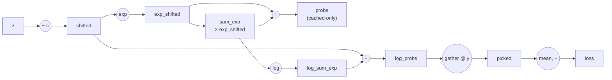

# Softmax + Cross-Entropy

## The idea

For multi-class classification, a network outputs one raw score
("logit") per class, and we need two things: a way to turn those scores
into a probability distribution (**softmax**), and a way to measure how far
that distribution is from the true label (**cross-entropy**). nabla
implements both together as a single `Function`,
[`SoftmaxCrossEntropy`](../src/nabla/ops/loss.py) — not because they can't
be expressed as separate ops, but because fusing them is both more
numerically stable *and* produces a dramatically simpler gradient. Both
reasons are worth spelling out.

## Softmax

For logits $z \in \mathbb{R}^K$ ($K$ classes):

$$
\text{softmax}(z)_k = \frac{e^{z_k}}{\sum_{j=1}^K e^{z_j}}
$$

This is a genuine problem to compute directly: if any logit is large (say
$z_k = 1000$), $e^{z_k}$ overflows a float64 long before it matters. The
fix is the **log-sum-exp trick** — softmax is invariant to subtracting any
constant $c$ from every logit (it cancels in the ratio), so subtracting the
row's max keeps every exponent $\le 0$:

$$
\text{softmax}(z)_k = \frac{e^{z_k - c}}{\sum_j e^{z_j - c}}, \qquad c = \max_j z_j
$$

```python
shifted = logits.data - logits.data.max(axis=1, keepdims=True)
exp_shifted = np.exp(shifted)
probs = exp_shifted / exp_shifted.sum(axis=1, keepdims=True)
```

## Cross-entropy

Given the true class index $y$ (an integer, not a `Tensor` in a
differentiable sense — see the note at the end), cross-entropy is just the
negative log-probability the model assigned to the correct class, averaged
over the batch:

$$
L = -\frac{1}{B}\sum_{n=1}^{B} \log \text{softmax}(z^{(n)})_{y^{(n)}}
$$

Computing $\log(\text{softmax}(z)_k)$ directly from `probs` would first
compute a (possibly tiny) probability and then take its log — losing
precision for exactly the confident, correct predictions you care about
getting right at the end of training. Since `shifted` and
`log(sum_exp)` are already on hand from the softmax computation above,
`log_probs` is computed directly instead:

$$
\log \text{softmax}(z)_k = (z_k - c) - \log \sum_j e^{z_j - c}
$$

```python
log_probs = shifted - np.log(sum_exp)
picked = log_probs[np.arange(batch_size), target_idx]
loss = -picked.mean()
```

## The gradient: why fusing the two ops pays off

Drawn as a graph the way
[BatchNorm2D's](04-batchnorm.md#backward-derived-from-the-computational-graph)
and [LayerNorm's](07-layernorm.md#backward-same-graph-different-axis)
backward passes are, forward looks like this (the `probs` branch is cached
for backward but isn't on the path `loss` actually depends on — the code
computes `log_probs` straight from `shifted`, for the precision reason
above):



Unlike BatchNorm2D/LayerNorm, nabla's backward here does **not** walk this
graph node by node — and there's a good reason not to. Every element of
`exp_shifted` feeds into the *same* `sum_exp`, which then feeds into every
element of `log_probs` through `logNode`/`subLSE` — so gradient fans back
out from one target class to all $K$ classes at the `sumNode`/`logNode`
step. Handled generically, that fan-out *is* softmax's Jacobian, just
spread across graph edges instead of packed into one $K \times K$ matrix —
same cost, more code to get right.

Composed with cross-entropy specifically, that fan-out collapses
algebraically instead. Writing $p = \text{softmax}(z)$ (the `probs` node)
and $y$ as the one-hot vector of the true class:

1. Only the target class contributes to the loss at all
   ($L = -\log p_y$), so $\partial L/\partial p_y = -1/p_y$ and
   $\partial L/\partial p_k = 0$ for every $k \ne y$.
2. Softmax's own local Jacobian is
   $\partial p_k/\partial z_j = p_k(\delta_{kj} - p_j)$.
3. Chain rule sums over $k$, but step 1 already zeroed out every term
   except $k = y$:

$$
\frac{\partial L}{\partial z_j} = \frac{\partial L}{\partial p_y}\cdot\frac{\partial p_y}{\partial z_j}
= \left(-\frac{1}{p_y}\right) p_y(\delta_{yj} - p_j) = p_j - \delta_{yj} = p_j - y_j
$$

$$
\frac{\partial L}{\partial z_k} = p_k - y_k
$$

The result: the gradient w.r.t. the logits is just the predicted
distribution minus the target distribution — subtract 1 from the
probability of the true class, leave everything else untouched, done:

```python
grad_logits = self.probs.copy()
grad_logits[np.arange(self.batch_size), self.target_idx] -= 1
grad_logits *= grad_output / self.batch_size
```

This is one of the cleanest gradients in the whole library — a nice
illustration of how choosing *where* to draw the boundary between ops can
matter as much for the backward pass as for the forward one. A
[`tests/test_loss.py`](../tests/test_loss.py) test checks exactly this
property directly: `grad_logits.sum(axis=1)` should be `0` for every row,
since both `probs` and the one-hot target sum to 1.

## `targets` isn't differentiable

`targets` (the integer class labels) is still passed through `Function.apply`
as a `Tensor` — mainly so it participates in the graph machinery the same
way every other input does — but it's never meaningful to differentiate
with respect to a class index. `backward` returns a zero array for it, and
since `CrossEntropyLoss` (the [`nn/loss.py`](../src/nabla/nn/loss.py)
wrapper) never sets `requires_grad=True` on it, that gradient is computed
but immediately discarded by `Tensor.backward()`'s
`if parent.requires_grad:` check (see
[Autodiff basics](01-autodiff.md#the-chain-rule-as-a-topological-sort)).
