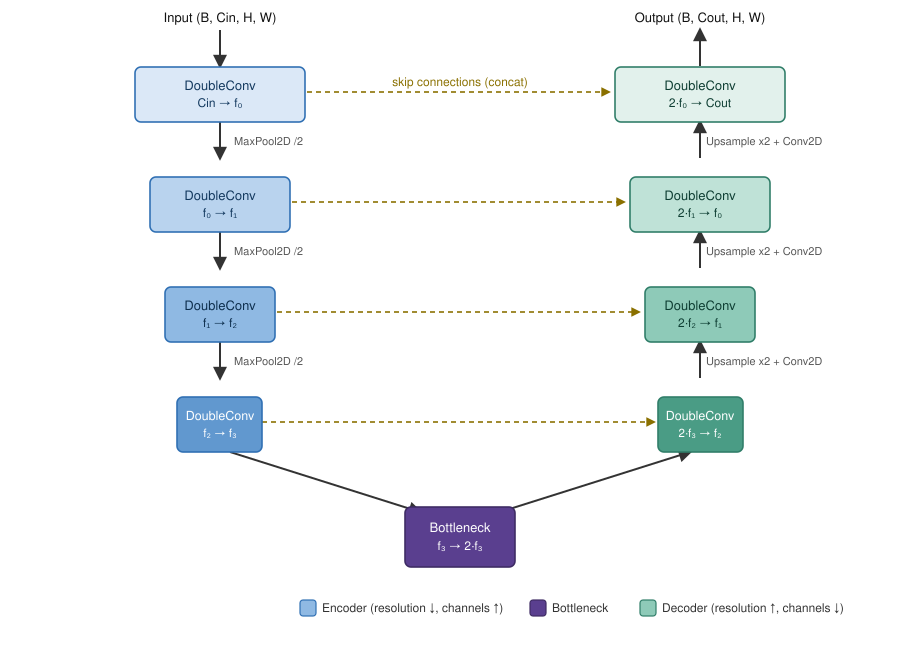

# U-Net

## Overview

`UNet` (`nn/unet.py`) is a 2D convolutional encoder-decoder for
per-pixel binary segmentation (Ronneberger et al., 2015). It takes an
image and returns a same-resolution map of raw logits: one unbounded
score per pixel, not yet a probability. Callers apply `.sigmoid()`
themselves wherever a probability is actually needed - before
[`DiceLoss`](27-dice-loss.md), or at inference time - rather than having
`UNet` apply it internally, so the loss can instead combine with
[`BCEWithLogitsLoss`](30-bce-with-logits.md), which needs raw logits to
stay numerically stable.



The encoder has `n` stages. Each runs a `DoubleConv` (see Implementation)
then halves `H, W` with `MaxPool2D`, doubling the channel count at every
stage (`features = (64, 128, 256, 512)` by default). A bottleneck
`DoubleConv` sits at the lowest resolution, doubling channels once more.
The decoder mirrors the encoder in reverse: each stage upsamples `x2`,
projects channels back down with a `Conv2D`, concatenates the matching
encoder stage's pre-pooling output (the **skip connection**), and runs
another `DoubleConv`. A final `1x1` `Conv2D` produces the output
logits.

Spatial resolution `H, W` halves at every encoder pooling step and
doubles back at every decoder upsampling step, so with `n` encoder
stages, `H` and `W` must be divisible by `2**n`.

**Why channels grow as resolution shrinks.** At full resolution, a pixel's
receptive field is small and a few channels are enough to represent local
structure (edges, texture). Each pool halves `H, W`, doubling every
surviving unit's receptive field in the original image without any extra
cost — so the same convolution now integrates information over a much
larger image region. Representing what can be *inferred* over that larger
region (is this part of a tumor? what tissue type?) takes more distinct
features than representing raw local texture did, so channel count is
doubled at each stage to compensate (`features = (64, 128, 256, 512)` by
default). This trade — resolution for channels — is what makes the
bottleneck's `2 * features[-1]`-channel representation *semantically*
richer than the input, even though it is spatially the coarsest.

The skip connections exist because that same trade is lossy for anything
the loss needs at pixel precision: a pixel's exact position on a tumor's
boundary is exactly the kind of information pooling throws away. Each
decoder stage gets both the coarse, semantic upsampled signal *and* the
matching encoder stage's full-resolution features, so the final mask can
use the deep representation to decide "is there a tumor here" and the
skip connection's fine detail to decide "precisely which pixels".

## Math

No new backward derivations here — `UNet` composes ops that already have
their own derivations: [`Conv2D`](02-conv2d.md), [`Pooling`](03-pooling.md),
[`BatchNorm2D`](04-batchnorm.md), [`Upsample`](26-upsample.md),
[`Concat`](16-concat.md), and `ReLU`/`Sigmoid`. Autodiff composes their
individual backward passes automatically; there is nothing U-Net-specific
to derive.

## Implementation

```python
class DoubleConv(Module):
    """(Conv2D -> BatchNorm2D -> ReLU) x2, padding=1 so H/W are unchanged."""

    def __init__(self, in_channels: int, out_channels: int) -> None:
        super().__init__()
        self.conv1 = Conv2D(in_channels, out_channels, kernel_size=3, padding=1)
        self.bn1 = BatchNorm2D(out_channels)
        self.conv2 = Conv2D(out_channels, out_channels, kernel_size=3, padding=1)
        self.bn2 = BatchNorm2D(out_channels)

    def forward(self, x: Tensor) -> Tensor:
        x = self.bn1(self.conv1(x)).relu()
        x = self.bn2(self.conv2(x)).relu()
        return x
```

```python
class UNet(Module):
    """2D U-Net for binary segmentation.

    Args:
        in_channels: Number of channels in the input image.
        out_channels: Number of output mask channels (1 for binary
            segmentation).
        features: Channel count at each encoder stage, shallowest first.
            Bottleneck uses `features[-1] * 2`; decoder mirrors `features`
            in reverse.

    Shape:
        - Input: (batch, in_channels, H, W), H and W divisible by
          2 ** len(features).
        - Output: (batch, out_channels, H, W), raw logits (unbounded).
    """
```

Encoder loop — save each stage's output before pooling, for the skip
connection:

```python
skips = []
for stage in self.encoder:
    x = stage(x)
    skips.append(x)
    x = x.max_pool2d(kernel_size=2, stride=2)

x = self.bottleneck(x)
```

Decoder loop — upsample, project channels down with a 1x1 `Conv2D`,
concatenate the matching skip (in reverse encoder order), then refine:

```python
for upsample, up_conv, decoder_stage, skip in zip(
    self.upsamples, self.up_convs, self.decoder, reversed(skips)
):
    x = up_conv(upsample(x))
    x = F.concat([skip, x], axis=1)
    x = decoder_stage(x)

return self.final_conv(x)  # raw logits - no sigmoid here, see Overview
```

`up_conv`'s in/out channel counts are derived once in `__init__` from
`features`, mirrored in reverse:

```python
reversed_features = list(reversed(features))
up_conv_in_channels = [features[-1] * 2] + reversed_features[:-1]
```

## Testing

[`tests/test_nn_unet.py`](../tests/test_nn_unet.py): `DoubleConv` shape
and non-negativity (post-ReLU); `UNet` forward shape at multiple depths
and channel configs, that output logits are unbounded (not squashed into
`[0, 1]`), full-graph gradient flow (encoder, decoder, bottleneck,
input), skip-connection dependency, train/eval toggling `BatchNorm2D`,
and input-type validation.
